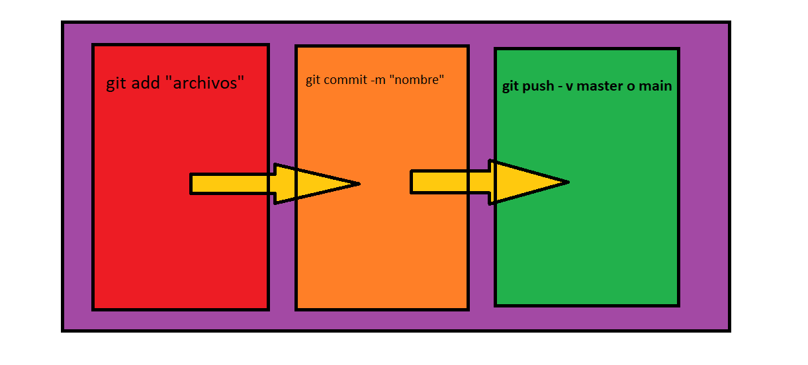

# Principios sobre `Git`
:zap: :zap: :zap: :zap:
> ¿QUE ES GIT? (https://git-scm.com/)

> Es un controlador de versiones, que nos va a ayudar a ser eficientes, como tambien nos ayudara a la mantenivilidad de un proyecto, ya que vamos a tener multiples verciones del proyecto. 

## Concepto de Git

> Como se puede apreciar en la imagen,  para por subir archivos a un proyecto, este proceso se divide en tres partes importantes 

